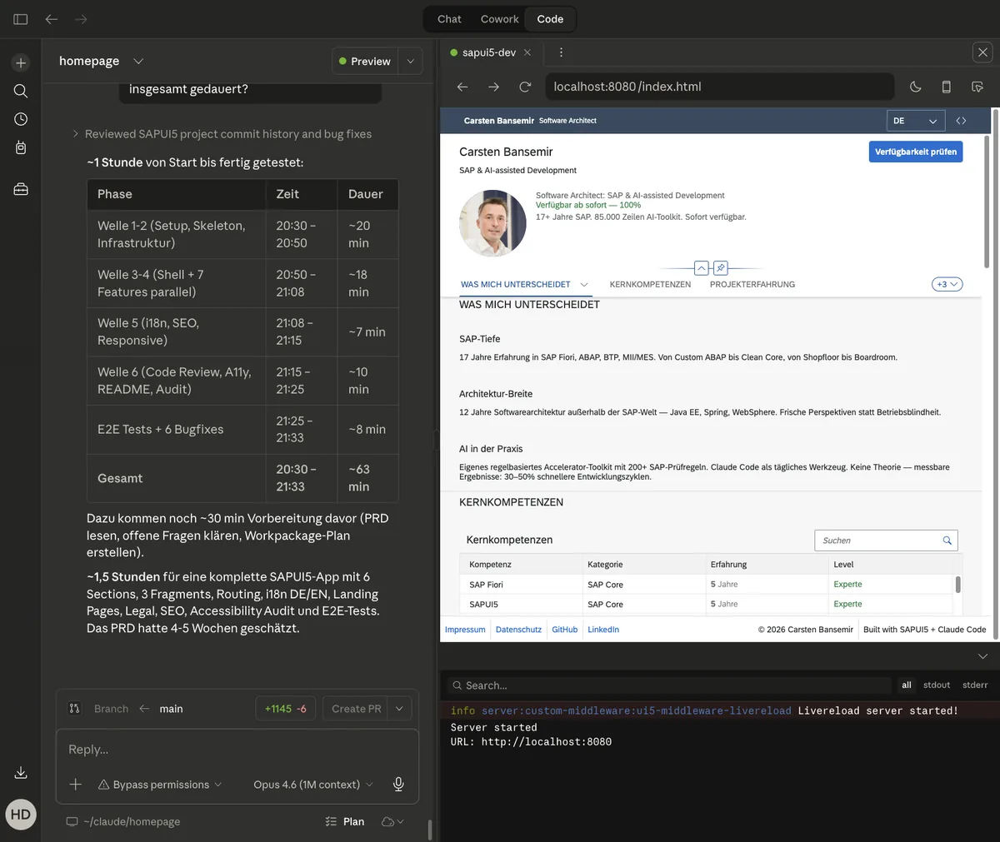

# bansemir.net — SAP Software Architect Portfolio

> A freelancer portfolio website built as a SAPUI5 application — because the best way to prove SAPUI5 expertise is to build with it.

**[Live Site](https://bansemir.net)** · **[SAPUI5 App](https://bansemir.net/app/)** · **[Case Study](https://bansemir.net/case-study/)** · **[Case Study (EN)](https://bansemir.net/case-study/en/)**


## The Build

This site was built in a single evening session — from PRD to production — using Claude Code as development orchestrator with SAP-specialized AI agents.

| Metric | Value |
|--------|-------|
| Pure implementation time | **63 minutes** |
| Total session (incl. planning, QA, deployment) | ~5 hours |
| Workpackages | 21, across 6 execution waves |
| AI agents | 9 specialized (SAP frontend, fullstack, QA, a11y) |
| Max parallel agents | 7 (Wave 4) |
| Lines of code | 10,834 |
| Files in main commit | 30 |
| Commits | 19 |
| UI5 Linter violations | 0 errors, 0 warnings |

The full build process is documented as a [Case Study](https://bansemir.net/case-study/) with 13 screenshots showing every phase. The [PRD](docs/PRD.md) that started it all is in this repo.




## What This Demonstrates

The medium is the message. Instead of listing SAP skills on a generic template, this site _is_ the proof: a fully functional SAPUI5 application with strict MVC separation, proper i18n, accessibility compliance, and zero linter warnings.

**For SAP project leads:** This is what structured AI-assisted development looks like in practice — not a prototype, but a production site with proper quality gates.

**For developers:** Every commit documents which agent implemented the change and which agents reviewed it. Check the git log.


## Tech Stack

| Layer | Technology |
|-------|-----------|
| Framework | SAPUI5 1.136 LTS (from SAP CDN) |
| Language | JavaScript ES6+ (`sap.ui.define` modules) |
| Tooling | @ui5/cli 4.x, ui5-middleware-livereload |
| Theme | sap_fiori_3 |
| Hosting | IONOS (static files) |
| Analytics | Plausible (GDPR-compliant, no cookie banner) |
| Booking | Calendly (embedded) |
| AI Tooling | Claude Code, @ui5/mcp-server, @sap-ux/fiori-mcp-server |


## Architecture

Hybrid approach: static landing pages handle SEO and initial load speed, the SAPUI5 SPA provides the interactive portfolio experience.

```
bansemir.net/
├── index.html              ← Root redirect (language detection)
├── de/index.html           ← Landing Page (German)
├── en/index.html           ← Landing Page (English)
├── case-study/             ← Case Study (DE + EN, static HTML)
├── app/webapp/             ← SAPUI5 Application
│   ├── Component.js        ← Root Component
│   ├── manifest.json       ← App Descriptor, Models, Routing
│   ├── controller/         ← MVC Controllers
│   ├── view/               ← XML Views + Fragments
│   ├── model/              ← JSON Data + Formatter
│   └── i18n/               ← DE + EN
├── content/                ← Source data for static page generation
├── assets/                 ← Images, Case Study screenshots
├── legal/                  ← Impressum, Datenschutz
├── docs/                   ← PRD, Session Log, Workpackages
├── sitemap.xml
└── robots.txt
```


## Design Decisions

**SAPUI5 instead of React/Astro/Next.js** — The site targets SAP hiring managers and project leads. Showing SAPUI5 proficiency through the site itself is more convincing than a React page that claims SAPUI5 expertise. The framework choice _is_ the portfolio.

**JavaScript instead of TypeScript** — Deliberate trade-off. TypeScript adds tooling complexity without changing the showcase value for a project of this size. The strict MVC separation and linter discipline provide the structural guarantees that TypeScript would add.

**Hybrid architecture** — Single-page applications are invisible to search engines without SSR. Rather than adding a rendering layer, the site uses static HTML landing pages for SEO and fast initial load, with the SAPUI5 app handling the interactive portfolio section.

**Strict MVC enforcement** — All data lives in JSON models declared in `manifest.json`. All UI is defined in XML views and fragments. Controllers handle events and navigation only. Formatters are pure functions. No exceptions.


## AI-Assisted Development Workflow

```
PRD (997 lines)
  → Project Planner Agent → 21 Workpackages in 6 Waves
    → SAP Frontend Developer Agent    ← Views, Controllers, Fragments
    → SAP Modern Fullstack Developer  ← Component.js, manifest.json, Routing
    → QA: Code Review Agent           ← 3 major findings → fixed
    → QA: Accessibility Auditor       ← WCAG 2.1 AA, 7 fixes
    → QA: E2E Test Agent              ← 11 tests across all pages
  → UI5 Linter validates every commit
  → Deploy via SFTP to IONOS
```

**MCP Server integration:**
- `@ui5/mcp-server` — UI5 linting, guidelines enforcement, API reference, manifest validation
- `@sap-ux/fiori-mcp-server` — Fiori documentation search, functionality lookup


## Quality Gates

| Check | Target | Status |
|-------|--------|--------|
| UI5 Linter | 0 errors, 0 warnings | Enforced |
| Accessibility | WCAG 2.1 AA | Audited |
| Landing Page Performance | Lighthouse >= 98 | Measured |
| Internationalization | Complete DE + EN | Verified |
| MVC Compliance | No violations | Reviewed |
| Code Quality | No deprecated APIs, no AI slop | Linted |


## Local Development

```bash
cd app
npm install
npx ui5 serve -o index.html
```

The dev server starts with livereload. The SAPUI5 framework loads from SAP CDN — no local UI5 installation required.


## Production Build

```bash
cd app
npx ui5 build --all --dest ../dist/app
```

Produces optimized, preload-bundled output in `dist/app/`. The landing pages and static assets are deployed separately alongside the built app.


## Project Data

The SAPUI5 app renders its content from JSON models — no backend, no API calls:

- `projects.json` — SAP project references with bilingual descriptions
- `skills.json` — Technical skills by category with experience levels
- `toolkit.json` — Developer tools built by the author
- `config.json` — Application configuration
- `casestudy.json` — Case study chapters with stats and images


## Documentation

- [PRD](docs/PRD.md) — Product Requirements Document (v2.1, 997 lines)
- [Session Log](docs/SESSION-LOG-2026-03-25.md) — Complete build session documentation
- [Workpackages](docs/WORKPACKAGES.md) — All 21 work packages with agent assignments
- [CLAUDE.md](CLAUDE.md) — AI agent rules and project conventions


## License

MIT


## Author

Carsten Bansemir — [bansemir.net](https://bansemir.net) · [LinkedIn](https://linkedin.com/in/carsten-bansemir) · [GitHub](https://github.com/bansemir)
